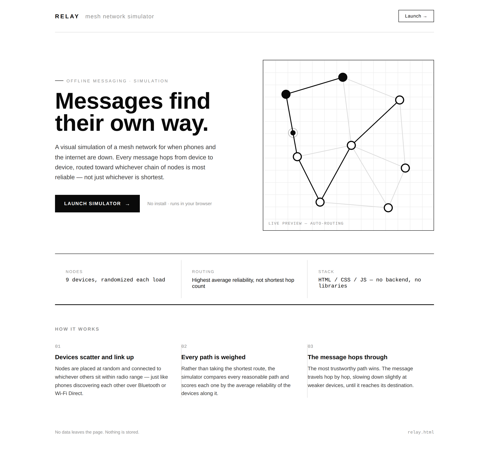
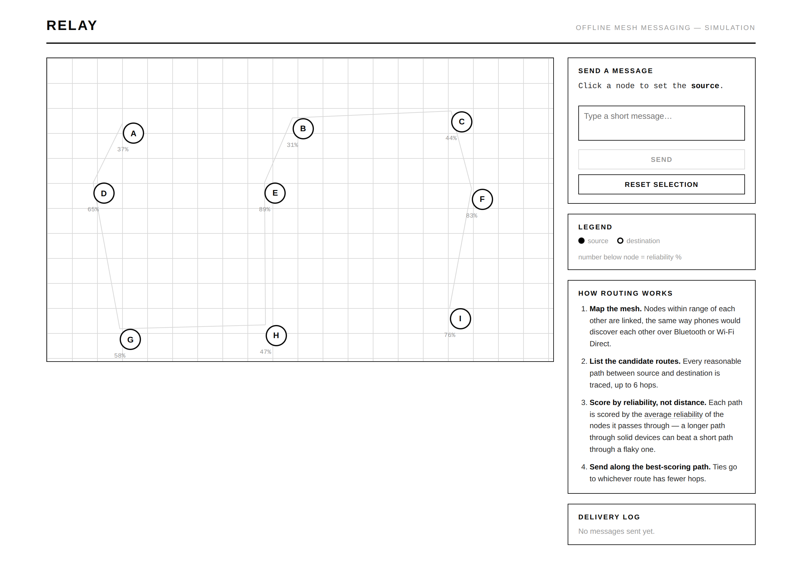
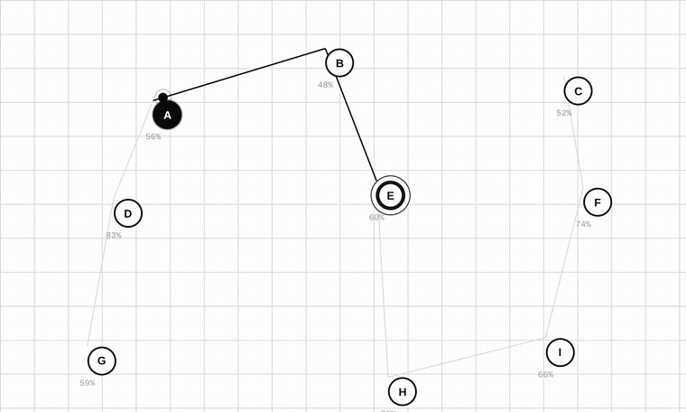

# Relay

A tiny, single-file simulation of an offline **mesh messaging network** — the kind of phone-to-phone relay you'd want when cell towers and internet are down. Built with plain HTML, CSS, and JavaScript. No frameworks, no backend, no dependencies.

  

## Preview

**Landing page**



The hero on the landing page isn't a static image — it's a live loop of the real routing logic, picking a random source and destination, finding the best path, and animating the hop:

![Live routing preview loop]hero_routing.gif)

**The simulator**



Sending a message: the packet hops node to node along the highest-reliability path, and the log records the route and delivery time.



## What it does

- Scatters 9 "phone" nodes across the screen, each with a random **reliability score** (30–99%).
- Connects nearby nodes with mesh links (like Bluetooth / Wi-Fi Direct range), and guarantees the whole network is reachable — no isolated islands.
- Click a **source** node, then a **destination** node, type a message, and hit **Send**.
- The app finds the path with the **highest average reliability** (not just the shortest path) and animates a packet hopping node-to-node until it arrives.
- Every send is recorded in a log with the route taken, delivery time, and average route reliability.
- The simulator page also has an in-app "How routing works" panel explaining the algorithm in plain language.

## Running it

There's nothing to install or build. Just open the file in a browser:

```
open index.html
```

`index.html` is the landing page; it links to `relay.html`, the actual simulator. Keep both files (and the `media/` folder, if you want the README images to resolve) in the same directory.

## How the routing works

This is the interesting part, so here's the short version (the code has inline comments too):

1. **Build the mesh** — every pair of nodes within a fixed range gets connected. A union-find check then joins any disconnected clusters by their closest pair, so every node can always reach every other node.
2. **Find candidate paths** — a depth-limited depth-first search enumerates simple paths (no repeated nodes) between the source and destination, capped at 6 hops to keep things fast.
3. **Score each path** — for every candidate path, take the **average reliability** of the nodes along it.
4. **Pick the winner** — the path with the highest average reliability is used, even if it's longer than the shortest possible route. Ties are broken by preferring fewer hops.
5. **Animate** — the packet travels hop-by-hop; each hop's speed is slowed down a little based on how unreliable the arriving node is, so weaker links visibly take longer.

## Project structure

```
.
├── index.html              landing page — pitch, live routing preview, link to the simulator
├── relay.html              the simulator itself
├── media/                  screenshots + GIFs used in this README
└── README.md
```

Inside `relay.html`, everything lives in one file by design, so the whole app is easy to read top to bottom:

```
relay.html
├── <style>   black/white/gray UI, node + link styling, log panel
└── <script>
    ├── 1. generateNodes()     — scatters nodes across the map
    ├── 2. buildEdges()        — connects nearby nodes, ensures connectivity
    ├── 3. render              — draws lines (SVG) and nodes (HTML circles)
    ├── 4. selection           — click-to-pick source/destination
    ├── 5. findBestPath()      — the reliability-based routing logic
    ├── 6. animatePath()       — moves the packet dot hop by hop
    └── 7. send handler        — ties routing + animation + logging together
```

## Notes

- Node layout, mesh links, and reliability scores are randomized on every page load — refresh for a new network.
- No data leaves the browser; there's no server, storage, or network calls involved. It's a visual simulation, not a real mesh protocol.

## License

Free to use, modify, and share.
